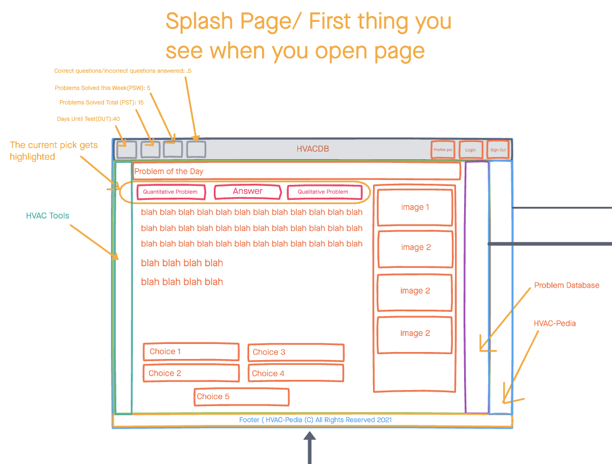
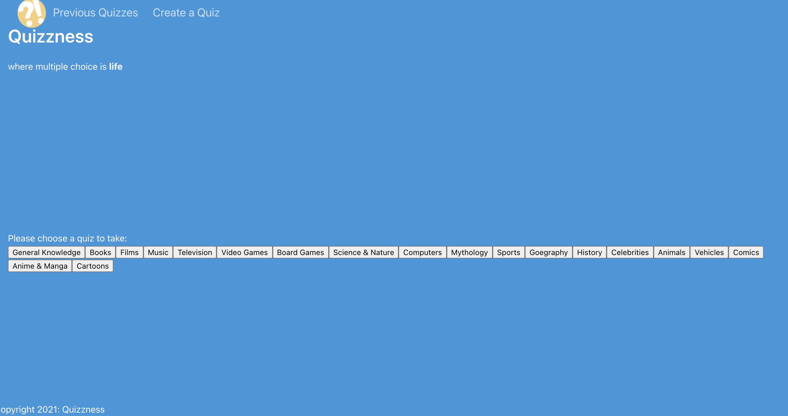
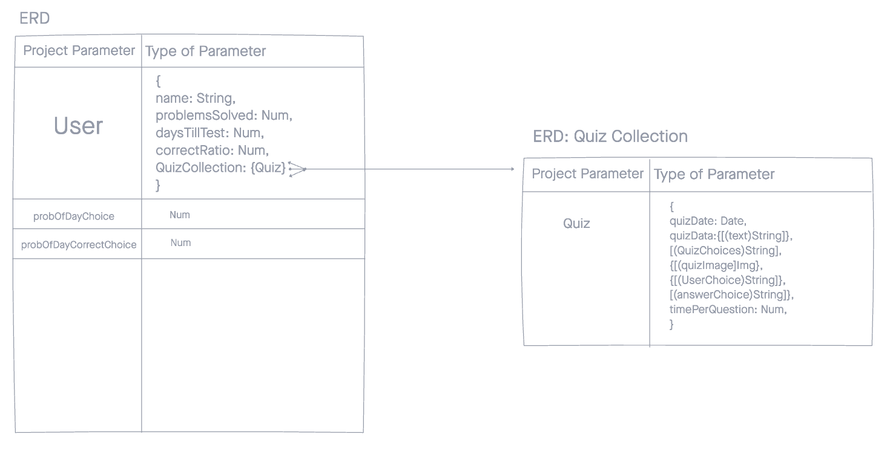

# Quizzness App

A fun, little SPA that allows a user to test their wits 

## technologies
- MongoDB
- Express
- React.js
- Node.js
- Bulma
- Heroku
- Netlify
- JSX
- OpenTDB API
- moment.js

## WireFrames

## Unsolved Problems
- I used CSS after I wrote my code, but with the Bulma framework, it seems theres specific heirarchy for modals that I didn't have with how I wrote my code. This resulted in not being able to do modals
- I wasnt able to include an edit function for the app that would allow the user to try their hand at a quiz again for a better score after a while

## Getting Started

[Click Here To Get Started](https://quizzness.netlify.app/)

## Future Enhancements
- login authentication
- quiz deletion
- more engaging CSS ( think jitter close to puttons, grid layout for buttons)